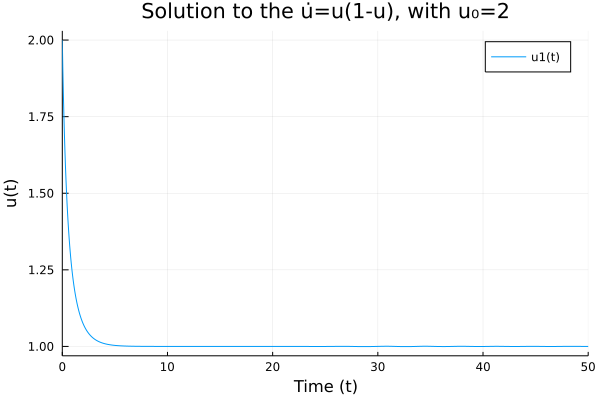

# Primeiros-Programas-Julia

##EDO 1: 
O senhor citou essa EDO na última reunião enquanto passava pelo livro e disse que eu poderia começar por ela. Anotei e fiz como segue.
```
using DifferentialEquations
f(u,p,t) = u*(1-u)
u0 = 2
tspan = (0.0,50.0)
prob = ODEProblem(f,u0,tspan)
sol = solve(prob)

using Plots
plot(sol, title="Solution to the u̇=u(1-u), with u₀=$u0",
     xaxis="Time (t)",yaxis="u(t)")
savefig("Graphic EDO1.png")
```
Foi gerado o gráfico:

